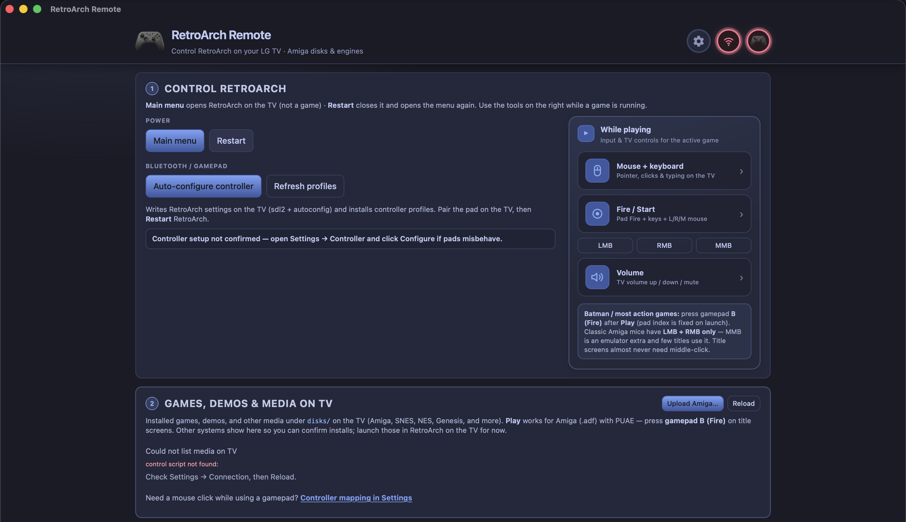
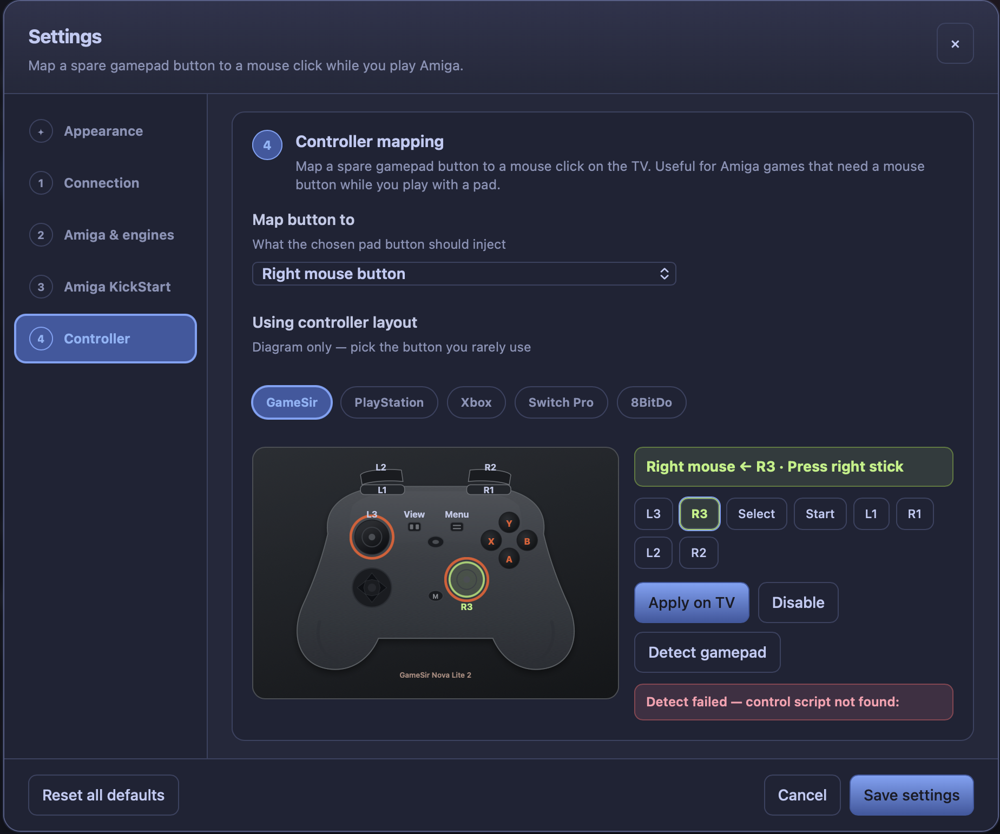

# RetroArch Remote (macOS)

> **We do not support piracy.**
>
> This project follows [RetroArch / Libretro](https://www.libretro.com/)'s official position:
>
> We at Libretro will not have anything to do with any kind of piracy, or the promotion/facilitation thereof. We do not support or condone in any way the unlicensed distribution of copyrighted ROMs elsewhere on the internet. Libretro as an entity and project does not promote or endorse willful copyright infringement.
>
> RetroArch and Libretro do not share any copyrighted system files or game content. You must provide your own BIOS and content in accordance with your local laws as applicable. We assume everyone dumps their own games in accordance with the laws and statutes applicable to their locale.

Tauri 2 + Bun + TypeScript desktop app to **control and configure RetroArch on a rooted webOS LG TV** over SSH.

It wraps the existing CLI:

```text
RetroArch/webos/control-retroarch.sh
```





## Features (v0.1)

- Connection settings (host, user, SSH key, script path)
- App: **Launch / Quit / Restart**
- List **Amiga .adf** disks → **Play** / **Remove**
- **Add…** file picker to upload local `.adf` images to the TV
- **Install ADFs from Archive.org**: classic games (A–Z), PD, demoscene → browse/search → install
- **Add custom catalog sites** (Archive.org URL or item id)
- **Volume** window (TV volume up / down via webOS Magic Remote buttons)
- **Virtual keyboard** (full QWERTY + F-keys; type to TV / RetroArch / Amiga)
- List **emulator cores**
- **Left / right mouse click** injection on the TV
- Live command log

## Requirements

- macOS
- [Bun](https://bun.sh)
- Rust / Cargo (for Tauri)
- SSH access to the TV (`~/.ssh/webos_deploy` by default)
- Checkout of RetroArch with `webos/control-retroarch.sh`

## Develop

```bash
cd ~/src/retroarch-control
bun install
bun run tauri dev
```

## Build .app

```bash
bun run tauri build
```

Output under `src-tauri/target/release/bundle/`.

## Defaults

| Setting | Default |
|---------|---------|
| Host | `192.168.0.79` |
| User | `root` |
| SSH key | `~/.ssh/webos_deploy` |
| Script | `~/src/RetroArch/webos/control-retroarch.sh` |

Change paths in the UI (saved in `localStorage`).

## Roadmap (optional)

- Enable / use RetroArch UDP network commands (pause, menu, disk next)
- Kickstart / system path status
- Edit PUAE core options in UI
- Generic SSH “any RetroArch host” (not only webOS)
- In-app terminal for `setup-amiga.sh` / `setup-cores.sh`

## License

Same spirit as RetroArch tooling — local utility for your setup.
